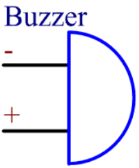

.. _cpn_buzzer:

Buzzer
=======

.. image:: img/buzzer1.png

A buzzer or beeper is an audio signaling device commonly used in computers, printers, copiers, alarms, electronic toys, automotive electronics, telephones, timers, and other electronics.

**Features**

* Oscillation Frequency: 2.3±0.3KHz
* Operating Voltage: 3 ~ 6VDC
* Rated Voltage: 5 VDC
* Current Consumption: MAX.25mA
* Sound Pressure Level: MIN. 85dB
* Tone Nature: Constant
* Operating Temperature: -20 ~ +45℃
* Storage Temperature: -25 ~ +60℃
* Dimension: Φ12.0 x H9.5mm
* Weight (MAX): 2.0 gram
* Housing Material: ABS( Black )

**Active Buzzer or Passive Buzzer**

Buzzers can be categorized as active and passive ones. Turn the buzzer so that its pins are facing up, and the buzzer with a green circuit board is a passive buzzer, while the one enclosed with a black tape is an active one.

.. image:: img/buzzer.png
    :width: 600

The difference between an active buzzer and a passive buzzer: 

* An active buzzer has a built-in oscillating source, so it will make sounds when electrified.
* But a passive buzzer does not have such source, so it will not beep if DC signals are used; instead, you need to use square waves whose frequency is between 2K and 5K to drive it.
* The active buzzer is often more expensive than the passive one because of multiple built-in oscillating circuits.

**How to Know Anode or Cathode?**

With a + in the surface represents the anode and the other is the cathode. 

You can also check the pins of the buzzer, the longer one is the anode and the shorter one is the cathode. Please don’t mix them up when connecting, otherwise the buzzer will not make sound. 

**Electrical Symbol**

**Demensions**

Unit: mm

**Active Buzzer Frequency Response Curve**

**Passive Buzzer Frequency Response Curve**

