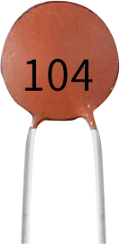
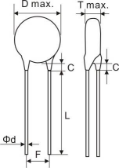

.. _cpn_capacitor:

Ceramic Capacitor
============================

**What is Ceramic Capacitor?**

A fixed value type of capacitor where the ceramic material within the capacitor acts as a dielectric is the Ceramic Capacitor. This capacitor consists of more number of alternating layers of ceramic and also a metal layer which acts as an electrode.

It is widely used in electronic circuits because of its large dielectric constant, large specific capacity, wide operating range, good humidity resistance, high insulation resistance, good heat resistance, and low dielectric loss.

**Features**

* Capacitance: 10x10^4pF (0.1uF)
* Rated voltage: 50V DC							
* Nominal capacity range: 80000PF~180000PF							
    Test conditions: 
        * Measurement voltage: 1±0.2Vrms   							
        * Frequency: 1KHZ							
        * Temperature: 25±2℃(Arbitration temperature)							
* Allowable deviation of capacity: +80%-20%							
* Loss angle tangent: tgδ≤2.5×10-2 							
* Insulation resistance (IR): ≥10000MΩ														
* Storage: Temperature: 0-40℃, Humidity: <80%RH							

**Ceramic Capacitor Polarity**

When connecting capacitors in an electric circuit, capacitor polarity is one of the most important factors to consider. Based on their polarity, capacitors can be divided into two groups:

* Polarised capacitor
* Non-polarised capacitor

Capacitors with polarization have two terminals, called anode and cathode. They must be connected in a specific order in the circuit. And when the capacitor is non-polarized, both terminals are the same and can be connected to the circuit at will.

A ceramic capacitor is a non-polarized device that is common in every electrical device.

Following is the symbol for ceramic capacitor:

.. image:: img/cer_cap_symbol.png
    :width: 300

**Read the capacitance value**

Usually ceramic capacitors have a two to three digit code printed on them.

* The first two digits describe the value of the capacitor and the last digit is a power of 10. After multiplying the first two digits together you get the capacitance value in pF.
* If there are only two digits, it means there is no multiplier, then you only need to read the value of the first two digits in picofarads.

For example:

* 104 = 10 x 10^4=100000pF
* 681 = 68 x 10^1 = 680pF

**Size**

* Outer diameter D: ф5.0±0.3mm	
* Lead length L: 14±1mm	
* Lead wire width F: 2.5±0.3mm	
* Wire diameter: ф0.35±0.02mm	
* Coating foot length C: 2.5 max	

**Unit Conversion**

    1F=10^3mF=10^6uF=10^9nF=10^12pF

