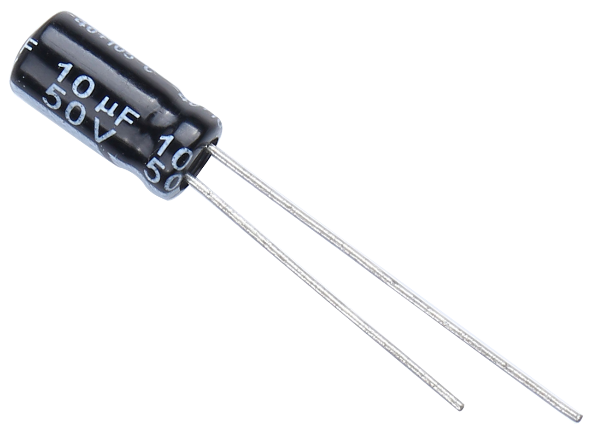
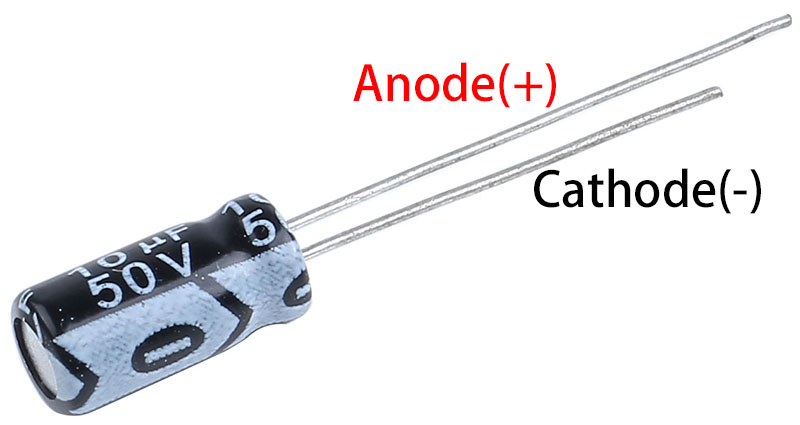
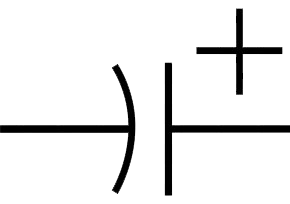

.. _cpn_elec_cap:

Electrolytic Capacitor
=========================

**What is Electrolytic Capacitor?**

A capacitor is an electronic component that stores energy in the form of electrical energy when charged, also known as a two-terminal passive component or capacitor, and is measured in Farads (F). It consists of two metal parallel plates which are separated by a gap filled with dielectric. They are of 3 types, they are fixed capacitors, polarized capacitors and variable capacitors. In the case of fixed capacitors with a fixed capacitance value, polarized capacitors have two polarities ("+ve" and "-ve"), while in variable capacitors the capacitance value can be changed according to the application.

This article focuses on electrolytic capacitors in polarized capacitors. Aluminum electrolytic capacitors are polarized capacitors in which the anode (+) terminal is formed by an aluminum foil and an etched surface. The anodizing process produces a thin layer of oxide insulation that is used as a dielectric. The cathode is formed through a second aluminum foil when a non-solid electrolyte masks the rough surface area of the oxide layer.

**Features:**

* Nominal Capacitance: 10UF
* Rated Voltage: 50V.
* Size: 5x11mm(0.2 x0.43in)
* Capacitance Tolerance: electrolytic +/-20%
* Operating Temperature Range: -40deg/C ~105+deg/C

**Capacitor Polarity Identification**

The polarity of capacitors can be identified in several ways as follows.

Based on the height of the capacitor leads we can identify which is negative polarity and which is positive polarity. Capacitor whose terminal is longer is a positive polarity terminal or an anode and the capacitor whose terminal is shorter is a negative polarity or cathode.

And the black arrow points to the negative terminal.

**Read the capacitance value**

.. image:: img/10uf_cap.png
    :width: 100
    :align: center

Capacitance, which refers to the amount of charge stored at a given potential difference, is denoted as C, and the international unit is the Farad (F). In general, charges are moved by forces in an electric field. When there is a dielectric between conductors, the movement of charge is impeded and the charge accumulates on the conductor, leading to an accumulation of charge.

Through-hole capacitors are marked with their capacitance value and maximum voltage rating. A capacitor with "10μF 50V" printed on it has a nominal capacitance value of 10μF and a maximum voltage rating of 50 volts, which should never be exceeded.

**Electrical Symbol**

**Use/Application**

A wide range of electrolytic capacitors are used in the following applications

* Used in filtering applications to reduce power supply ripple
* Used as low-pass filters to smooth input and output signals
* Used as a filter in audio amplifier circuits to reduce hum

**Unit Conversion**

    1F=10^3mF=10^6uF=10^9nF=10^12pF

