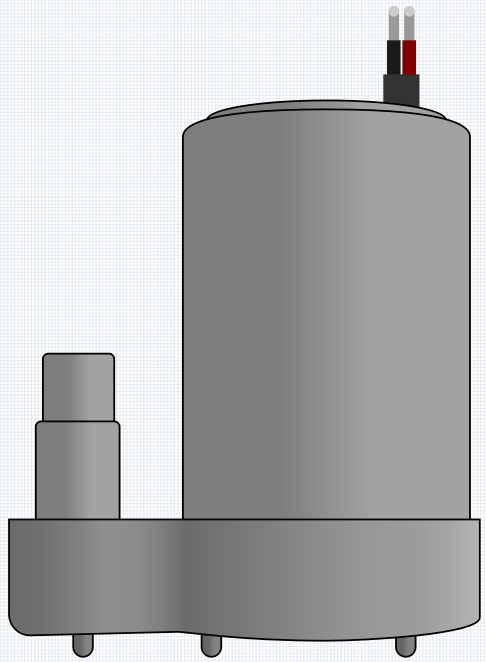
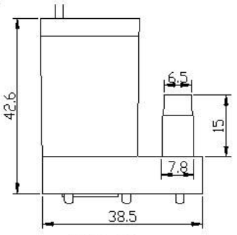

.. _cpn_pump:

Centrifugal Pump
================

这款 3V 立式潜水低功率水泵是创建小型室内水景或作为植物浇水系统的一部分的理想解决方案。泵的核心是一个 3V 直流电机，运行安静，仅消耗大约 100mA。

泵在使用前需要注水，并且在使用过程中应保持完全浸没，因为它只会抽水而不抽空气。此外，它仅作为泵在一个方向上工作，您不能反转连接并让它向另一个方向移动水。

The centrifugal pump converts rotational kinetic energy into hydrodynamic energy to transport fluid. The rotation energy comes from the electric motor. The fluid enters the pump impeller along or near the rotating shaft, is accelerated by the impeller, flows radially outward into the diffuser or volute chamber, and then flows out from there.

Common uses of centrifugal pumps include water, sewage, agricultural, petroleum, and petrochemical pumping.

**使用方式**

尺寸

单位：mm

**Features**
    * **Voltage Scope**: DC 3 ~ 4.5V
    * **Operating Current**: 120 ~ 180mA
    * **Power**: 0.36 ~ 0.91W
    * **Max Water Head**: 0.35 ~ 0.55M
    * **Max Flow Rate**: 80 ~ 100 L/H
    * **Continuous Working Life**: 100 hours
    * **Water Fing Grade**: IP68
    * **Driving Mode**: DC, Magnetic Driving
    * **Material**: Engineering Plastic
    * **Outlet Outside Diameter**: 7.8 mm
    * **Outlet Inside Diameter**: 6.5 mm
    * It is a submersible pump and should be used that way. It tends to heat too much that there's a risk of overheating if you turn it on unsubmerged.

