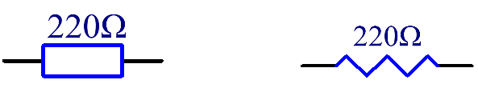
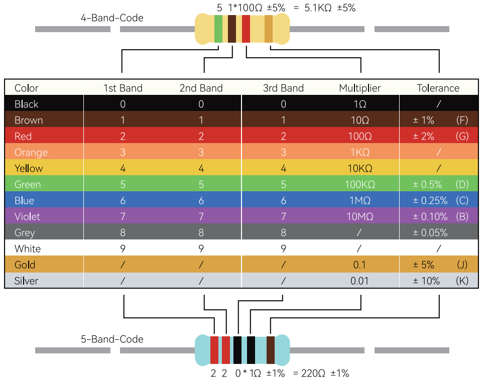

.. _cpn_resistor:

Resistor
============

**What is a resistor?**

Resistor is an electronic element that can limit the branch current. 
A fixed resistor is a kind of resistor whose resistance cannot be changed, while that of a potentiometer or a variable resistor can be adjusted. 

**Features**

* Tolerance ±1%
* Power (Watts): 0.25W, 1/4W
* Composition Metal Film
* Features Flame Retardant Coating, Safety
* Operating Temperature -55°C ~ 155°C
* Low cost
* Generates less noise than carbon composition resistor
* Wide operating range
* Long-term stability

**Electrical Symbol**

Two generally used circuit symbols for resistor. Normally, the resistance is marked on it. So if you see these symbols in a circuit, it stands for a resistor. 

**Ω** is the unit of resistance and the larger units include KΩ, MΩ, etc. Their relationship can be shown as follows: 1 MΩ=1000 KΩ, 1 KΩ = 1000 Ω.

**How to know the resistance?**

When using a resistor, we need to know its resistance first. Here are two methods: 

* Observe the bands on the resistor
* Use a multimeter to measure the resistance. 

If you are familiar with the color ring table below, it is a quick and easy method by looking at the color band on the resistor. As shown in the table below, if you follow a specific method of calculation after reading the color band, it is easy to get the resistance of the resistor.

Normally, when you get a resistor, you may find it hard to decide which end to start for reading the color. 
The tip is that the gap between the 4th and 5th band will be comparatively larger.

Therefore, you can observe the gap between the two chromatic bands at one end of the resistor; 
if it's larger than any other band gaps, then you can read from the opposite side. 

Let’s see how to read the resistance value of a 5-band resistor as shown below.

.. image:: img/220ohm.jpg
    :width: 500

So for this resistor, the resistance is 2(red) 2(red) 0(black) x 10^0(black) Ω = 220 Ω, and the permissible error is ± 1% (brown). 

Due to different resistor manufacturers, the color band may be a bit off, resulting in incorrect readings of the resistance value. In this case, you can also use a multimeter to check the resistance.

**SunFounder general resistor color band table**

.. list-table::

    * - Resistor 
      - Color Band  
    * - 10Ω   
      - brown black black silver brown
    * - 100Ω   
      - brown black black black brown
    * - 220Ω 
      - red red black black brown
    * - 330Ω 
      - orange orange black black brown
    * - 1kΩ 
      - brown black black brown brown
    * - 2kΩ 
      - red black black brown brown
    * - 5.1kΩ 
      - green brown black brown brown
    * - 10kΩ 
      - brown black black red brown 
    * - 100kΩ 
      - brown black black orange brown 
    * - 1MΩ 
      - brown black black green brown 

**Unit Conversion**

**Ω** is the unit of resistance and the larger units include KΩ, MΩ, etc. 
Their relationship can be shown as follows: 1 MΩ=1000 KΩ, 1 KΩ = 1000 Ω. Normally, the value of resistance is marked on it. 

.. You can learn more about resistor from Wiki: `Resistor - Wikipedia <https://en.wikipedia.org/wiki/Resistor>`_.

