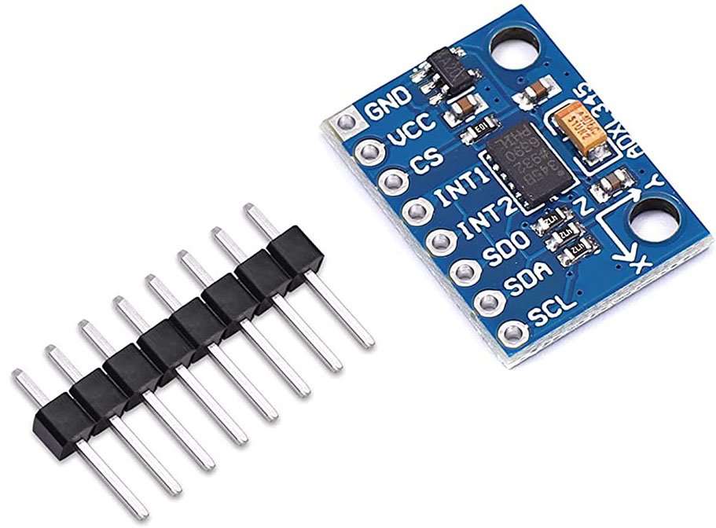
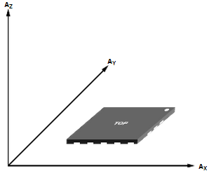
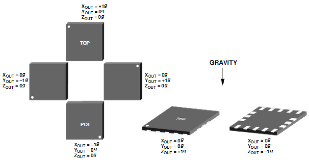
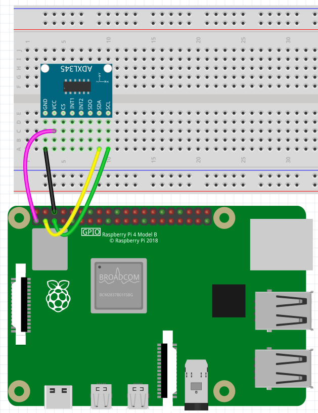

.. _module_adxl345:

ADXL345 Module
=======================

The purpose of this project is to introduce you to the ADXL345 module and show you how to use it with Arduino and Raspberry Pi.

About ADXL345 Module
----------------------------

* **GND**: Cathode of the power supply.
* **VCC**: The power supply is connected to 3-5V.
* **CS**: Chip select.
* **INT1**: Interrupt the output 1.
* **INT2**: Interrupt the output 2.
* **SD0**: Serial data output (SPI 4 wire), spare I2C address choose(I2C).
* **SDA**: Serial data (I2C), Serial data input (SPI line 4), Serial data input, output(SPI Line 3)
* **SCL**: Serial data (I2C), Serial data input (SPI line 4), Serial data input, output(SPI Line 3)

The ADXL345 is a small, thin, ultralow power, 3-axis accelerometer with high resolution (13-bit) measurement at up to ±16 g. Digital output data is formatted as 16-bit twos complement and is accessible through either a SPI (3- or 4-wire) or I2C digital interface. 

The ADXL345 is well suited for mobile device applications. It measures the static acceleration of gravity in tilt-sensing applications, as well as dynamic acceleration resulting from motion or shock. Its high resolution (3.9 mg/LSB) enables measurement of inclination changes less than 1.0°.

* `ADXL345 - datasheet <https://www.analog.com/media/en/technical-documentation/data-sheets/ADXL345-EP.pdf>`_

**Main Features**

* Type: GY-291
* Chip: ADXL345
* Power Supply: 3~5V
* Communication Mode: Standard IIC/SPI communicating protocol
* Measuring Range: ±2g±16g
* 3 axis, ± 2g/ ± 4g/ ± 8g/ ± 16g

**Application**

* Mobile Phone
* Medical instrument
* Game and pointing device
* Industrial instrument
* Personal navigation device
* HDD Protection from falling
* Screen flip on tablet computer

**Principle**

ADXL345 works like this:

**Axes of detection by ADXL345**

When you place the module face up, Z_OUT is at the maximum which is +1g; face down, Z_OUT is at the minimum. No matter of face, as long as it’s placed on a level surface, X_OUT increases along the Ax axis direction, so does Y_OUT along the Ay axis. See the picture below. Thus, when you rotate the module, you can see the changes of X_OUT, Y_OUT, and Z_OUT.

Relationship between output and gravity direction

**Schematic**

How to use?
---------------------

Use with Arduino
^^^^^^^^^^^^^^^^^^^^^^^^^^^
If you are Arduino user, you can follow the steps to use the module.

#. Build the circuit.

    .. image:: img/adxl345_circuit_ar.png

#. In the **Library Manager**, type ``adxl345`` and choose a library to install. **Adafruit ADXL345** is installed here, and choosing **INSTALL ALL** in the pop-up window is recommended.

    .. image:: img/adxl345_library.png

#. Open the sample code.

    .. image:: img/adxl345_sensortest.png

#. Select the board and port, here it is Arduino Uno, you can select other boards if you are using other boards.

    .. image:: img/adxl345_board.png

#. Upload the code to your Arduino board.

    .. image:: img/adxl345_upload.png
    
#. Set the baud rate to 9600 in the serial monitor to see acceleration on the X, Y, and Z axes. You can turn the module in all directions and see how the values printed change.

    .. image:: img/adxl345_value.png

Use with Raspberry Pi
^^^^^^^^^^^^^^^^^^^^^^^^^^^^^^^^^

Refer to the following tutorial if you intend to use the ADXL345 module on Raspberry Pi.

**1. Connecting Raspberry Pi and ADXL345 module**

Follow the diagram below to plug the ADXL345 module into the breadboard first, then go to connect the Raspberry Pi. With the male - female cable, you can also connect this module directly to the Raspberry Pi if you don't have a breadboard.

Wire the **GND** pin of the module to Physical **Pin 6 (GND)** on the Raspberry Pi.
Wire the **VCC** pin of the module to Physical **Pin 1 (3v3)** on the Raspberry Pi.
Wire the **SDA** pin of the module to Physical **Pin 3 (SDA)** on the Raspberry Pi.
Wire the **SCL** pin of the module to Physical **Pin 5 (SCL)** on the Raspberry Pi.

**2. Configuring the Raspberry Pi**

The Raspberry Pi's configuration must be altered before it can retrieve data from the  ADXL345 module.

#. Let's first make sure everything is up to date by running the following two commands.

    .. code-block::

        sudo apt-get update
        sudo apt-get upgrade

#. In order to enable I2C on the Raspberry Pi, we will need to launch the Raspberry configuration tool once the Raspberry Pi has been updated.

    .. code-block:: 

        sudo raspi-config

    * On this screen, you need to go to the **3 Interface Options** menu.
    * The ARROW keys can be used to navigate through the raspi-config tools menu. Select an option by pressing ENTER.
    * Now in the interface options menu, go ahead and select **I5 I2C**.
    * When asked if you would like to enable the ARM I2C interface, select **<YES>**.

#. I2C is now enabled, so we can go ahead and install the packages we will use to talk to the ADXL345 module. In the latest Raspberry Pi OS(Bullseye), these tools are already installed by default, you can skip this step.

    .. code-block:: 

        sudo apt-get install python3-dev python3-pip python3-smbus i2c-tools -y

#. Now let's check if the Raspberry Pi can see the ADXL345 module.

    .. code-block::

        sudo i2cdetect -y 1

    From this command, you should see quite a bit displayed on the command line. In this result, you should see at least one number, for example **53**.

    .. code-block::

        pi@raspberrypi:~ $ sudo i2cdetect -y 1
            0  1  2  3  4  5  6  7  8  9  a  b  c  d  e  f
        00:                         -- -- -- -- -- -- -- --
        10: -- -- -- -- -- -- -- -- -- -- -- -- -- -- -- --
        20: -- -- -- -- -- -- -- -- -- -- -- -- -- -- -- --
        30: -- -- -- -- -- -- -- -- -- -- -- -- -- -- -- --
        40: -- -- -- -- -- -- -- -- -- -- -- -- -- -- -- --
        50: -- -- -- 53 -- -- -- -- -- -- -- -- -- -- -- --
        60: -- -- -- -- -- -- -- -- -- -- -- -- -- -- -- --
        70: -- -- -- -- -- -- -- --

    If nothing appears, make sure the ADXL345 accelerometer is properly connected to the Raspberry Pi and that all solder joints on the sensor pins are clean. If you see errors, try re-enabling I2C again.

**3. Writing code**

To talk to ADXL345, we will use |link_adafruit_adxl345_python|, but you need to check your Python version first, because this library does not support Python 2.x.

#. Type ``python``, the current version of Python will appear and you can use ``exit()`` to exit.

    .. code-block::

        pi@raspberrypi:~ $ python
        Python 3.9.2 (default, Feb 28 2021, 17:03:44)
        [GCC 10.2.1 20210110] on linux
        Type "help", "copyright", "credits" or "license" for more information.
        >>> exit()

#. If you have Python 2.x, use the following command to install Python 3.

    .. code-block::

        sudo apt-get install python3

#. Now you can use the following command to install |link_adafruit_adxl345_python|.

    .. code-block::

        sudo pip3 install adafruit-circuitpython-adxl34x

#. Now that all the packages we need are installed on the Raspberry Pi, we can start writing Python script to read information from the accelerometer. Use the following command to create a new blank script.

    .. code-block::

        nano adxl345.py

#. Copy the following sample code into it.

    .. code-block:: python

        import time
        import board
        import adafruit_adxl34x

        i2c = board.I2C()  # uses board.SCL and board.SDA

        # For ADXL345
        accelerometer = adafruit_adxl34x.ADXL345(i2c)

        while True:
            print("%f %f %f" % accelerometer.acceleration)
            time.sleep(0.2)

    When you are sure that all the code is correct, you can press ``CTRL+X`` then ``Y`` and then ``ENTER`` to save it.

#. With the code now done, let’s go ahead and run the script.

    .. code-block::

        python3 ./adxl345.py

    By running this code, you should see the values being read in from the accelerometer. 

    .. code-block::

        pi@raspberrypi:~/Documents $ python3 ./adxl345.py
        0.000000 0.000000 0.000000
        0.000000 -0.196133 9.218251
        0.000000 -0.156906 9.061345
        0.000000 -0.196133 9.022118
        0.000000 -0.156906 9.022118
        0.000000 -0.117680 9.022118
        0.000000 -0.156906 9.061345
        0.000000 -0.117680 9.061345
        0.000000 -0.117680 9.061345
        0.000000 -0.156906 9.061345
        0.000000 -0.117680 9.022118
        0.000000 -0.156906 9.061345
        0.000000 -0.156906 9.061345
        -0.039227 -0.156906 8.982891

    Press ``Ctrl+C`` to stop running the script.

**4. More about ADXL345 Accelerometer Library**

In addition to reading the acceleration(``accelerometer.acceleration``), this library can also perform the following detections.

* ``acceleration`` - The acceleration values on the x, y and z axes
* ``enable_motion_detection`` - Enables motion detection. Allows for setting threshold. Threshold defaults to 18.
* ``enable_tap_detection`` - Enables tap detection. Allows for single or double-tap detection.
* ``enable_freefall_detection`` - Enables freefall detection. Allows for setting threshold and time. Threshold defaults to 10, time defaults to 25.
* ``events`` - Used to read the events when motion detection, tap detection and freefall detection are enables. Requires specifying which event you are trying to read.

For specific usage examples, please refer to: https://github.com/adafruit/Adafruit_CircuitPython_ADXL34x/tree/main/examples.